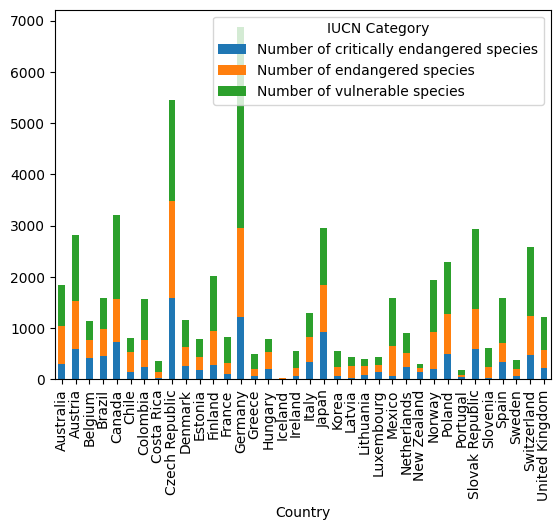
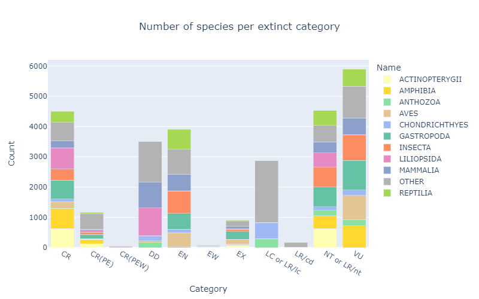

# Project of Data Visualization (COM-480) : IUCN Red List

| Student's name  | SCIPER |
| --------------- | ------ |
| Colin Hofmann   | 301952 |
| Ludovic Burnier | 301308 |
| Perrine Kergoat | 295892 |

[Website](https://com-480-data-visualization.github.io/project-2023-lcp-data-wizards/)

## Milestone 1 (7th April, 5pm)

**10% of the final grade**

This is a preliminary milestone to let you set up goals for your final project and assess the feasibility of your ideas.
Please, fill the following sections about your project.

*(max. 2000 characters per section)*

### Dataset

#### Composition

Our dataset is composed of 5 files and can be found in the [`data`](./data) folder. The different files are:
- [country_marine_protected_area.csv](./data/country_marine_protected_area.csv)
- [country_terrestrial_protected_area.csv](./data/country_terrestrial_protected_area.csv)
- [country_vulnerable.csv](./data/country_vulnerable.csv)
- [red_list_index_country_timeseries.csv](./data/red_list_index_country_timeseries.csv)
- [species.csv](./data/species.csv)
  
Those files are all CSV files and were downloaded on Kaggle from [here](https://www.kaggle.com/datasets/johnharshith/number-of-species-in-each-iucn-red-list-category) and [here](https://www.kaggle.com/datasets/sarthakvajpayee/global-species-extinction).

#### Description
Note that this dataset is, as specified and Kaggle, not official data but rather a new dataset created based on [IUCN Red List's](https://www.iucnredlist.org/) data.

The IUCN Red List is an indicator world’s biodiversity health. This tool is used to design and measure conservation action and policy and it helps inform conservation decisions. It regroups information about species’ range of distribution, population size, habitats and ecology, use and trade, threats, and conservation actions.

##### [Country marine protected area](./data/country_marine_protected_area.csv)
This file contains information about the size of marine protected areas in different countries. It includes
an evolution of those areas over time.

##### [Country terrestrial protected area](./data/country_terrestrial_protected_area.csv)
This file contains information about the size of terrestrial protected areas in different countries. It includes an evolution of those areas over time.

##### [Country vulnerable](./data/country_vulnerable.csv)
This file contains information about the vulnerable species in different countries and repartition of those species in different categories.

##### [Red list index country timeseries](./data/red_list_index_country_timeseries.csv)
This file contains the evolution of the red list index in different countries.

##### [Species](./data/species.csv)
This file contains information about the different species and their categories of vulnerability.

### Problematic

Our visualization of the datasets aims to highlight the biodiversity hotspots that are most in need of conservation policy and action. Looking at the number of threatened, vulnerable, or even extinct species in different countries would show the overall state of biodiversity in the world while moving away from the flag species we often hear about in the media. 

This project is intended for all those who are interested in understanding the importancy of the conservation of the species all around the world. 

### Exploratory Data Analysis
The dataset is already cleaned and ready to be used. We don't need to do any data cleaning or a lot of pre-processing. Some columns and rows might be dropped for the final visualization, but we will keep them for now.

To get a first idea of the data, we will use the `pandas` library to load the data and display some basic statistics. We will also use the `matplotlib` and `plotly` libraries to plot some graphs to get a better understanding of the data.

For now, we'll limit the exploration to some basic graphs, but it already give us an idea of what we can do with the data.

#### Country marine protected area

Note that the data is not available for all countries, so the graph is not complete.

#### Country terrestrial protected area

The data is similar to the previous graph, the two files contain the same data but for different types of protected areas.

#### Country vulnerable
 

This graph shows the number of threatened species per country and the repartition of those species in different categories. With this file we'll be able to have a better understanding of the different categories of the IUCN Red List and how they are distributed in different countries.

#### Red list index country timeseries
 

This graph shows the evolution of the Red List Index over time. The Red List Index is a measure of the overall extinction risk of all species in a country. The dataset contains the index for all countries, but here we only focus on some of them for a better visualization.

#### Species
 

Here we show the number of species per category of extinction. We can see for each category the repartition of the species. We kept the top 10 species and merged all others into a "Other" category for a better visualization.

Here is a list of the categories abbreviations:
- `CR`: Critically Endangered
- `CR(PE)`: Critically Endangered (Possibly Extinct)
- `CR(PEW)`: Critically Endangered (Possibly Extinct in the Wild)
- `DD`: Data Deficient
- `EN`: Endangered
- `EW`: Extinct in the Wild
- `EX`: Extinct
- `LC or LR/lc`: Least Concern (includes Lower Risk/least concern)
- `LR/cd`: Lower Risk/Conservation Dependent
- `NT or LR/nt`: Never Threatened (includes Lower Risk/never threatened)
- `VU`: Vulnerable

### Related work

The row [IUCN Red Lists datasets](https://www.iucnredlist.org/resources/spatial-data-download) are largley used as reference by governmental and non-governmental institutions to create [reports](https://nc.iucnredlist.org/redlist/resources/files/1630480997-IUCN_RED_LIST_QUADRENNIAL_REPORT_2017-2020.pdf) about taxa conservation. These data are often used to create plots and visualy interpretable figures in those technical documents. 
Those data, provided by searchers in biology and conservation are also used in a lot of publications in in renowned scientific journals. These data are used to asess [biodiversity threats](https://www.nature.com/articles/s41559-021-01542-9), [anthropogenic impacts on species](https://www.nature.com/articles/s41467-023-37089-5), evolution of the [headcounts of certain monitored species](https://www.nature.com/articles/s41467-022-35091-x), ...

For this project, we have chosen to use a condensed version of these huge data. In this way, we want to compare phylogenetic taxa and focus on the comparison between countries rather than on the type of life form or species. 

We would like to explore three main axis. First display a map that would show for each country the number of species present on the different categories of the IUCN lists. Second, it would be interesting to show the evolution of the number of theatened species since 1950 in these countries. Finally, we would like to look at the species present in the Red List for the different phylogenetic taxa.

To imagine our project, we got inspiration from different sources : 
- [Natural catastrophes project (2020)](https://github.com/com-480-data-visualization/com-480-project-big-yoshi-club)
- [Covid cases evolution in Switzerland project (2020)](https://github.com/com-480-data-visualization/com-480-project-lcelo)
- [IUCN Map of threatened species](https://www.iucnredlist.org/resources/other-spatial-downloads)
- [IUCN Map of endagered ecosystems](http://assessments.iucnrle.org/)

## Milestone 2 (7th May, 5pm)

**10% of the final grade**

### Sketch - Pieces to implement - ideas

Our website is composed of 1 page, composed of 3 different sections. 

All the sections are linked together, and the user can interact with the different plots to get more information about a specific country (or a specific category of species). Also the website will have a year slider, to let the user choose the year he wants to see the data for.

The first section will be a map of the world, with the countries colored according to the IUCN Red List Index. The user will be able to hover over a country to get more information about it (name, Red List Index, number of species in each category). The user will also be able to click on a country to get more information about it in the other sections. Also bellow this map there will be 2 graphs, one showing the repartition of the all species in the different IUCN categories, and the other showing the same thing but detailed for each species. All of this linked to the map, so that when the user clicks on a country, the graphs will show the data for this country.

The second section will be composed of two line charts showing the evolution of protected areas of the selected country over the years. The first graph will show this evolution on the terestrial protected areas, and the second one will show the evolution of the marine protected areas.

The third section will be a phylogenetic tree on the left, showing the different species present in the selected country. On the right side, we will have a bar chart showing the number of species in each category of the IUCN Red List according to the selected species (on the left side).

### Tools and lectures 

Obviously the three main tools we will use are d3.js, React and github pages. 
More specifically for d3.js, we will use geoPath to draw the map as seen in the lectures, as well as basic histograms, bar and line charts. Finally for the tree we think about using the d3 hierarchy tree layout. 

This should cover our most important needs, but some other tools might become handy along the way. Finally we will refer to the lecture on interactivity in d3.js to try to make our project as interactive as possible. 

To help doing this we want to make some plots change according to the user's interaction with another plot (showing a histogram for a chosen country on the map for example). We won't forget to chose our colors wisely according to the lecture on color perception to let the data be as clear as possible.

All of this while of course keeping in mind the do's and don'ts of data visualization (hence for example the use of bar charts instead of pie charts).

### Project prototype
[Website](https://com-480-data-visualization.github.io/project-2023-lcp-data-wizards/)

## Milestone 3 (4th June, 5pm)

**80% of the final grade**

## Late policy

- < 24h: 80% of the grade for the milestone
- < 48h: 70% of the grade for the milestone

